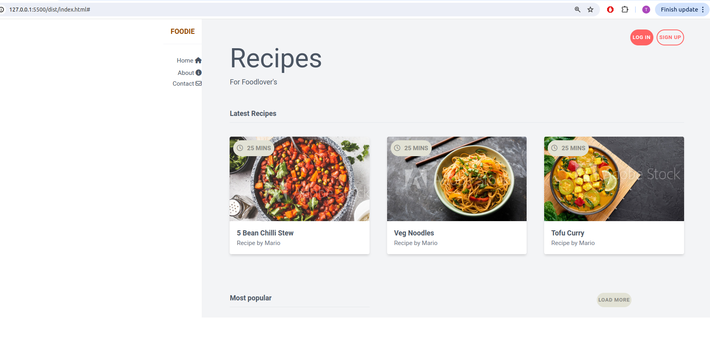
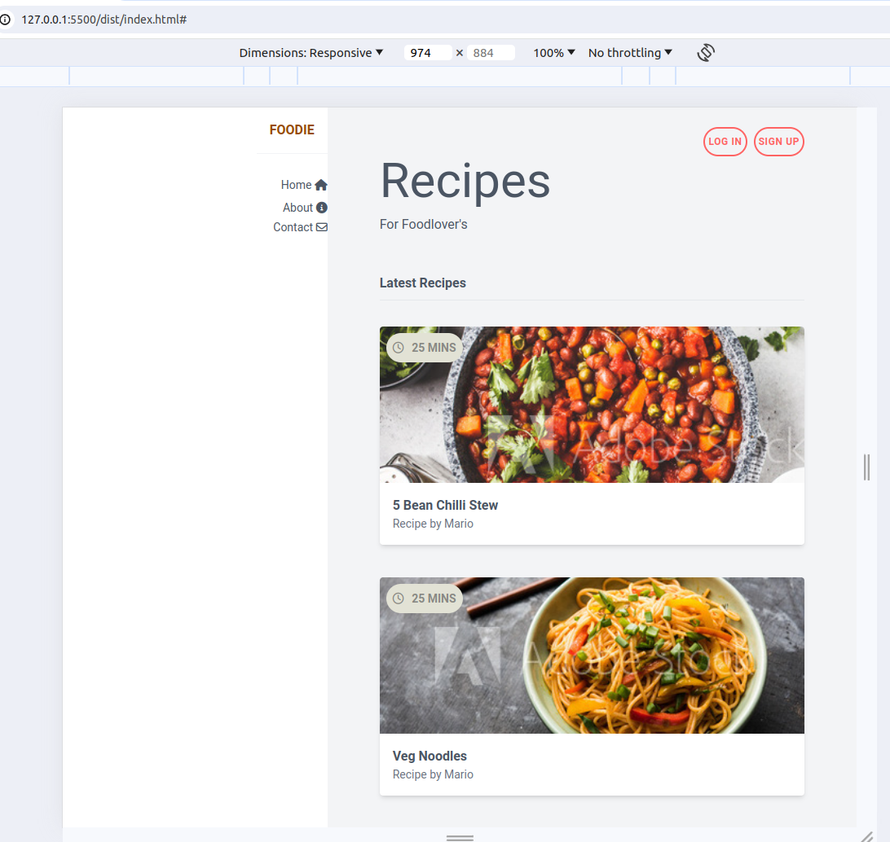

##  🍽️ Food App Projet

This project utilizes Tailwind CSS to build custom designs without writing traditional CSS. Whether you’re new to frontend development or looking to streamline your CSS workflow, this project will provide you with essential knowledge to start using Tailwind CSS effectively.

## Tailwind CSS

Tailwind CSS is a utility-first CSS framework that provides low-level utility classes to build designs directly in your markup. Unlike traditional CSS frameworks that come with pre-designed components, Tailwind focuses on providing small, composable utility classes to help you create your own unique designs. This approach allows for greater flexibility and customization while keeping your HTML clean and semantic.

## 🌟 Features

- **Utility-First**: Build designs by applying utility classes directly in your HTML.
- **Customizable**: Tailwind CSS allows you to customize your design system by configuring utility classes, colors, spacing, and more.
- **Responsive**: Easily create responsive designs using Tailwind’s responsive utility classes.
- **Performance**: Tailwind’s utility classes are purged in production builds, resulting in smaller CSS files.

## 🛠️ Technologies Used

- **Tailwind CSS**: A utility-first CSS framework for creating custom designs directly in your HTML.
- **Font Awesome**: A popular icon set and toolkit for adding scalable vector icons to the project.
- **HTML**: The structure of the web pages.
- **JavaScript**: For potential interactivity (though not the primary focus in this project).
## 📦 Installation

1. **Clone the Repository**

   ```bash
   git clone git@github.com:TaranaGit/FoodApp.git
   ```
2.  **Navigate to the project directory**
    ```bash
     cd FoodApp
    ```
3. **Install dependencies**
    ```bash
    npm install
    ```
4. **Start the application**
   
    run using Live-server 

## 📚 Tailwind CSS Features Explored

This project is designed to be a learning resource for beginners in Tailwind CSS. The following Tailwind CSS utilities and concepts are emphasized:

- **Responsive Design**: Adjust layouts and elements based on screen sizes using responsive utility classes.
- **Hover Effects**: Utilize `hover:` to create dynamic, interactive elements.
- **Grid Layout**: Implement grid systems for arranging content in a flexible and responsive manner.
- **Button Styling**: Customize buttons using classes like `btn-primary` to create visually appealing calls to action.
- **Padding & Margin**: Understand the basics of spacing within the layout.
- **Alignment & Justification**: Center content and justify elements to create balanced designs.


## 🖥️ Screenshots


